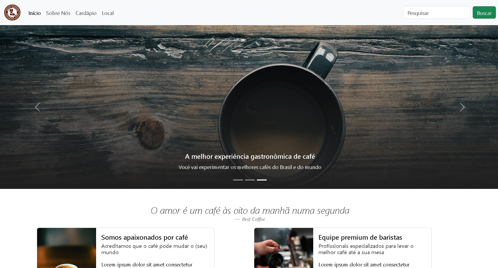

<h1 align="center">Best Coffee</h1>

O Best Coffee é um projeto desenvolvido com o objetivo de aplicar os conhecimentos adquiridos sobre o framework Bootstrap.

 

  

  <a href="#-tecnologias">Tecnologias</a>

## 🚀 Tecnologias

Esse projeto foi desenvolvido com as seguintes tecnologias:

- HTML e CSS
- Bootstrap
- Git e Github
- Figma

 

    <a href="https://thiagogreiner.github.io/Cafeteria/">Visualize o projeto aqui</a>

